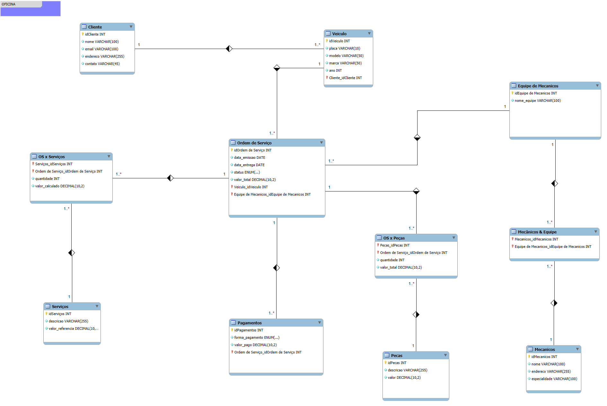

# 🚗 Banco de Dados para Oficina Mecânica 🔧

## 📌 Descrição do Projeto

Este projeto apresenta um modelo conceitual de banco de dados para uma oficina mecânica, desenvolvido no MySQL Workbench utilizando o diagrama EER (Enhanced Entity-Relationship Model). O sistema gerencia clientes, veículos, ordens de serviço, mecânicos, serviços, peças e pagamentos de forma eficiente e organizada.

## 📊 Estrutura do Banco de Dados

### 🏗️ Entidades e Atributos

#### 🧑‍💼 Clientes

- `id_cliente (PK)` - INT, Identificador único do cliente.
- `nome` - VARCHAR(100), Nome do cliente.
- `email` - VARCHAR(100), E-mail para contato.
- `endereco` - VARCHAR(255), Endereço do cliente.

#### 🚘 Veículos

- `id_veiculo (PK)` - INT, Identificador único do veículo.
- `id_cliente (FK)` - INT, Relacionamento com o cliente proprietário.
- `placa` - VARCHAR(10), Placa do veículo.
- `modelo` - VARCHAR(50), Modelo do veículo.
- `marca` - VARCHAR(50), Marca do veículo.
- `ano` - INT, Ano de fabricação do veículo.

#### 🛠️ Mecânicos

- `id_mecanico (PK)` - INT, Identificador único do mecânico.
- `nome` - VARCHAR(100), Nome do mecânico.
- `endereco` - VARCHAR(255), Endereço do mecânico.
- `especialidade` - VARCHAR(100), Área de especialização do mecânico.

#### 👥 Equipe de Mecânicos

- `id_equipe (PK)` - INT, Identificador único da equipe.
- `nome_equipe` - VARCHAR(100), Nome da equipe.

#### 🔗 Relação Mecânicos & Equipe

- `id_equipe (FK)` - INT, Relacionamento com a equipe.
- `id_mecanico (FK)` - INT, Relacionamento com o mecânico.

#### 📄 Ordem de Serviço (OS)

- `id_os (PK)` - INT, Identificador único da OS.
- `id_veiculo (FK)` - INT, Relacionamento com o veículo.
- `id_equipe (FK)` - INT, Relacionamento com a equipe responsável.
- `data_emissao` - DATE, Data de emissão da OS.
- `data_entrega` - DATE, Data prevista para conclusão.
- `status` - ENUM('Aberta', 'Em andamento', 'Finalizada', 'Cancelada'), Status da OS.
- `valor_total` - DECIMAL(10,2), Valor total da OS.

#### 🏷️ Serviços

- `id_servico (PK)` - INT, Identificador único do serviço.
- `descricao` - VARCHAR(255), Descrição do serviço prestado.
- `valor_referencia` - DECIMAL(10,2), Valor de referência da mão de obra.

#### 🔄 OS x Serviços (Relação N:M)

- `id_os (FK)` - INT, Relacionamento com a OS.
- `id_servico (FK)` - INT, Relacionamento com o serviço.
- `quantidade` - INT, Quantidade do serviço realizado.
- `valor_calculado` - DECIMAL(10,2), Valor final considerando a quantidade.

#### 🔩 Peças

- `id_peca (PK)` - INT, Identificador único da peça.
- `descricao` - VARCHAR(255), Descrição da peça.
- `valor` - DECIMAL(10,2), Valor unitário da peça.

#### 🔗 OS x Peças (Relação N:M)

- `id_os (FK)` - INT, Relacionamento com a OS.
- `id_peca (FK)` - INT, Relacionamento com a peça.
- `quantidade` - INT, Quantidade da peça utilizada.
- `valor_total` - DECIMAL(10,2), Valor calculado.

#### 💳 Pagamentos

- `id_pagamento (PK)` - INT, Identificador único do pagamento.
- `id_os (FK)` - INT, Relacionamento com a OS.
- `forma_pagamento` - ENUM('Dinheiro', 'Cartão de Crédito', 'Cartão de Débito', 'Pix', 'Boleto'), Forma de pagamento.
- `valor_pago` - DECIMAL(10,2), Valor pago.

### 🔄 Relacionamentos

- **Cliente x Veículo (1:N)** - Um cliente pode ter vários veículos, mas cada veículo pertence a apenas um cliente.
- **Veículo x OS (1:N)** - Um veículo pode ter várias OS, mas cada OS está ligada a um único veículo.
- **Equipe x OS (1:N)** - Uma equipe pode realizar várias OS, mas cada OS é atribuída a apenas uma equipe.
- **Mecânico x Equipe (N:M)** - Um mecânico pode pertencer a várias equipes, e uma equipe pode ter vários mecânicos.
- **OS x Serviços (N:M)** - Uma OS pode conter vários serviços, e um serviço pode estar em várias OS.
- **OS x Peças (N:M)** - Uma OS pode incluir várias peças, e uma peça pode estar presente em diversas OS.
- **OS x Pagamento (1:N)** - Uma OS pode ter mais de um pagamento associado.

## 🎯 Resultados Obtidos

Após criar as tabelas e definir os relacionamentos, o modelo de banco de dados para a oficina mecânica estará completo. O diagrama EER criado no MySQL Workbench será uma representação visual da estrutura, facilitando a compreensão do fluxo de dados no sistema.

### 👀 Veja como ficou o Diagrama EER:

## ✨ Conclusão

Esse projeto de modelagem de banco de dados para oficina mecânica oferece uma base sólida para o desenvolvimento do sistema. A relação entre **Cliente**, **Veículos**, **Mecânicos**, **Equipe de Mecânicos**, **Ordem de Serviço**, **Peças** e **Pagamentos** está bem definida, permitindo a implementação de funcionalidades essenciais para uma oficina.

## 🏞️ Links Importantes

Explore mais sobre modelagem de bancos de dados e o MySQL Workbench com os links abaixo:

- [MySQL Workbench](https://dev.mysql.com/downloads/workbench/)
- [Documentação do MySQL](https://dev.mysql.com/doc/)
- [Guia de Modelagem de Dados](https://www.lucidchart.com/pages/pt/modelo-entidade-relacionamento)

🔥 **Pronto para mais?**  
Agora que você completou a modelagem, o próximo passo é implementar o banco de dados ou explorar mais sobre modelagem de dados para expandir seus conhecimentos. Vamos continuar nossa jornada no mundo do desenvolvimento de sistemas! 💥🚀

